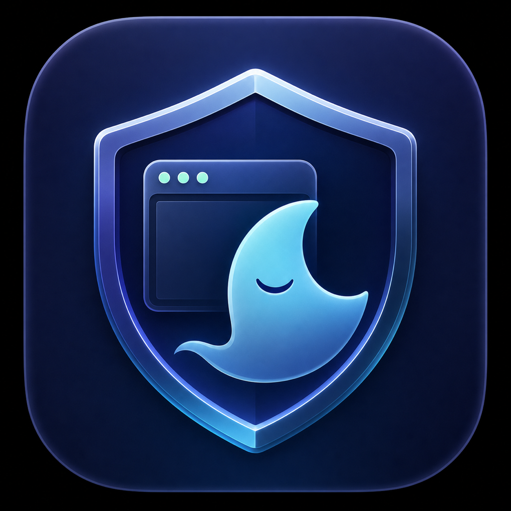
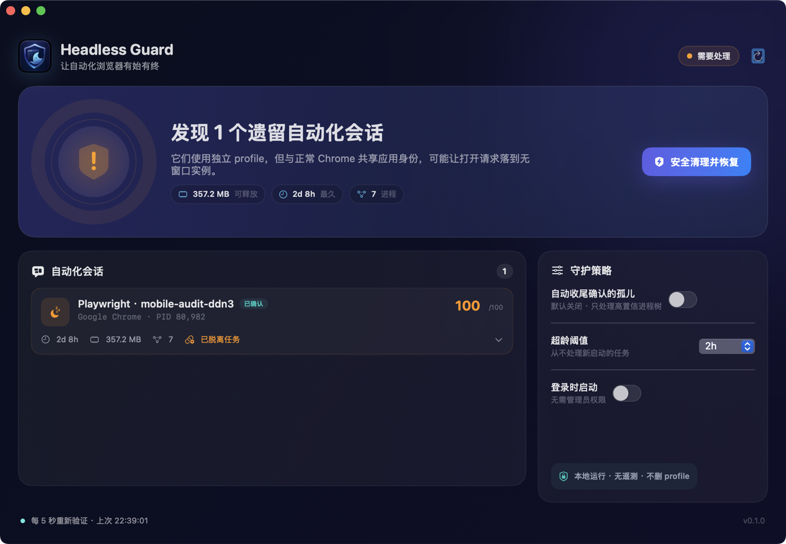
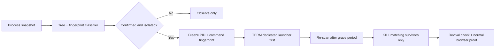

<p align="center">
  
</p>

<h1 align="center">Headless Guard</h1>

<p align="center">
  A native macOS utility that finds and safely stops orphaned automation browsers<br>
  before they hijack Chrome launches or quietly consume system resources.
</p>

<p align="center">
  <a href="https://github.com/study8677/HeadlessGuard/releases/latest"></a>
  <a href="https://github.com/study8677/HeadlessGuard/releases"></a>
  <a href="https://github.com/study8677/HeadlessGuard/actions/workflows/ci.yml"></a>
  
  <a href="LICENSE"></a>
</p>

<p align="center">
  <a href="https://github.com/study8677/HeadlessGuard/releases/latest"><strong>Download latest</strong></a>
  · <a href="#quick-start">Quick start</a>
  · <a href="docs/SAFETY.md">Safety model</a>
  · <a href="README.zh-CN.md">简体中文</a>
</p>



> [!IMPORTANT]
> Headless Guard is observe-only by default. Cleanup is offered only when a browser tree has multiple independent automation fingerprints. Ordinary browser windows, standard profiles, extensions, and unrelated Node/Codex workers are hard-protected.

## Why Headless Guard

Browser automation does not always end when its task ends. A detached Playwright, Puppeteer, Rod, Selenium, or Chrome-for-Testing launcher can leave an invisible browser alive for hours or days. On macOS, a headless instance launched from the system Chrome app can share Chrome's application identity, so a normal “Open Chrome” request may land in a process with no window.

Killing every process named Chrome is dangerous. Headless Guard instead reconstructs the process tree, explains the evidence, stops the dedicated automation launcher first, and verifies that the same process did not return.

## What it does

- Detects Playwright, Puppeteer, Rod, WebDriver, Selenium, Chrome, Chromium, Edge, Firefox, and WebKit automation fingerprints.
- Groups launchers, browser roots, renderers, GPU processes, and utilities into one session.
- Scores every incident with visible evidence such as `--headless`, isolated profiles, debugging pipes, parentage, and age.
- Hard-protects ordinary Chrome and standard user profiles.
- Cleans confirmed trees with `SIGTERM`, revalidates identity, then uses `SIGKILL` only for matching survivors.
- Watches from the menu bar with optional, explicitly enabled cleanup for confirmed stale orphans.
- Ships the same safety engine as a scriptable CLI.
- Runs locally with no administrator access, network requests, telemetry, or profile deletion.

## Quick start

### Download the app

1. Download the Apple Silicon archive from [Releases](https://github.com/study8677/HeadlessGuard/releases/latest).
2. Unzip it and move **Headless Guard.app** to Applications.
3. The first public build is ad-hoc signed, not Apple-notarized. Right-click the app and choose **Open** the first time.
4. Leave the default **Observe** policy on, inspect any detected session, then choose **Clean & restore**.

Or build locally with Apple's command-line tools:

```bash
git clone https://github.com/study8677/HeadlessGuard.git
cd HeadlessGuard
make install
```

Requirements: macOS 13 or later. The current prebuilt release targets Apple Silicon; source builds work on the architecture provided by your Swift toolchain.

### Use the CLI

```bash
# Explain every detected signal. Makes no changes.
swift run headless-guard scan --explain

# Preview exactly what would be stopped.
swift run headless-guard rescue --dry-run

# Apply only the confirmed cleanup plan.
swift run headless-guard rescue --yes

# Watch without changing anything.
swift run headless-guard watch
```

Machine-readable output is available through `scan --json`. Automatic CLI cleanup is opt-in through `watch --auto-clean --older-than 120`.

## Safety model

| Session | Detection | Automatic cleanup |
| --- | --- | --- |
| Ordinary browser and standard profile | Protected | Never |
| Confirmed headless automation with isolated profile and protocol evidence | Confirmed | Eligible only after opt-in |
| Headed automation session | Review | Never |
| Manual DevTools / single `--headless` signal | Review | Never |
| Ambiguous browser using a normal profile | Warning | Never |

Cleanup follows a fixed state machine:



There is deliberately no `killall Chrome`, broad `pkill`, process-name-only rule, or profile deletion. Read the complete [safety model](docs/SAFETY.md).

## A real recovery

Headless Guard was built against a real orphan on a 16 GB Mac:

- A detached `playwright-core/.../cliDaemon.js mobile-audit-ddn3` had lived for more than two days.
- Its child system Chrome carried `--headless`, `--remote-debugging-pipe`, and a `playwright_chromiumdev_profile-*` path.
- The app grouped seven processes and classified the incident at 100/100 confidence.
- The release CLI stopped only that tree, reclaimed roughly 365 MB at cleanup time, observed no classified revival for 15 seconds, and preserved the existing normal Chrome PID.

This is not a claim that every slow Mac is caused by headless browsers. Headless Guard shows the actual per-session footprint so other pressure remains visible.

## Privacy and permissions

Headless Guard:

- does not require `sudo`, Accessibility, Full Disk Access, or browser extensions;
- does not send network requests or telemetry;
- does not read browser history, cookies, page contents, or credentials;
- does not delete automation profiles;
- reads the local process list and sends signals only to eligible same-user processes.

See [PRIVACY.md](PRIVACY.md) for the exact boundary.

## Build and test

```bash
swift test
swift build -c release
make app
make package
```

The project has no third-party runtime dependencies. The Swift package contains:

```text
HeadlessGuardKit   process snapshots, graphing, classification, cleanup
headless-guard     scan, explain, rescue, watch, doctor, JSON output
HeadlessGuardApp   SwiftUI dashboard, menu bar, guard policy, login item
```

Read [ARCHITECTURE.md](docs/ARCHITECTURE.md) for internals and extension rules.

## Troubleshooting

- **The app reports “Review only.”** One signal is not enough to terminate safely. Expand the evidence and report a missed detection if the session is known automation.
- **The session returns.** Its supervisor is still alive. Stop retrying and inspect the named launcher; Headless Guard avoids kill loops.
- **Chrome is still slow after the list is clear.** Check Chrome's own task manager and system memory pressure. A clean Headless Guard scan rules out this specific failure mode, not all performance causes.
- **The first launch is blocked.** The current release is not notarized. Use right-click → Open or build from source.

More help: [Troubleshooting](docs/TROUBLESHOOTING.md) · [Support](SUPPORT.md)

## Contributing

Detection changes are safety changes. New fingerprints must include a redacted fixture or focused regression test proving both the match and the nearest normal-browser counterexample.

Read [CONTRIBUTING.md](CONTRIBUTING.md), use the dedicated [false-positive report](https://github.com/study8677/HeadlessGuard/issues/new?template=false_positive.yml), or start with a [`good first issue`](https://github.com/study8677/HeadlessGuard/labels/good%20first%20issue).

## Roadmap

- Direct macOS process APIs with PID start-time identity.
- Graceful Playwright daemon socket close when the session socket still exists.
- Signed and notarized universal build.
- Homebrew cask after the binary distribution is notarized.
- Redacted diagnostic bundle and session allowlist.

## License

Headless Guard is available under the [MIT License](LICENSE).
