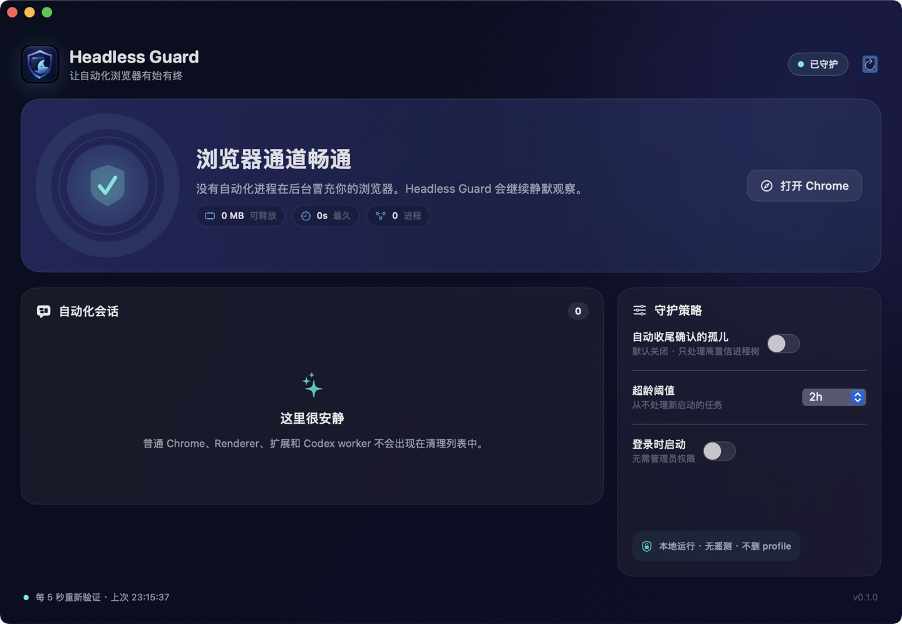

<p align="center">
  
</p>

<h1 align="center">Headless Guard</h1>

<p align="center">
  一个原生 macOS 工具：识别并安全停止任务结束后仍残留的无头浏览器，<br>
  避免它们截走 Chrome 打开请求或悄悄占用系统资源。
</p>

<p align="center">
  <a href="https://github.com/study8677/HeadlessGuard/releases/latest"><strong>下载最新版</strong></a>
  · <a href="#30-秒上手">30 秒上手</a>
  · <a href="docs/SAFETY.md">安全模型</a>
  · <a href="README.md">English</a>
</p>


> [!IMPORTANT]
> Headless Guard 默认只观察。只有同时命中多项独立自动化证据的进程树，才会进入可清理列表。正常浏览器窗口、正式 profile、扩展进程和无关的 Node/Codex worker 都受到硬保护。

## 为什么需要它

浏览器自动化任务结束，不代表浏览器一定退出。Playwright、Puppeteer、Rod、Selenium 或 Chrome for Testing 的 launcher 可能脱离原任务，在后台活上几小时甚至几天。

如果无头实例直接启动了系统 Chrome，它与正常 Chrome 共用 macOS 应用身份，“打开 Chrome”的请求就可能落到没有窗口的实例。粗暴执行 `killall Chrome` 会连正常标签页一起杀掉；Headless Guard 会先还原进程树、展示判断依据，只停止专用自动化 launcher 与对应子树，并检查它是否复活。

## 核心能力

- 识别 Playwright、Puppeteer、Rod、WebDriver、Selenium 及常见浏览器自动化指纹。
- 将 launcher、浏览器主进程、Renderer、GPU 与 Utility 归为一个会话。
- 用 `--headless`、隔离 profile、调试管道、父子关系和运行时长解释每次判断。
- 对普通 Chrome 和正式用户 profile 做硬保护。
- 先 `SIGTERM`，重新核对身份后才对残留目标使用 `SIGKILL`。
- 提供原生 SwiftUI 面板、菜单栏守护与同一安全核心的 CLI。
- 完全本地运行，无管理员权限、无网络请求、无遥测、不删除 profile。

## 30 秒上手

### 安装应用

1. 从 [Releases](https://github.com/study8677/HeadlessGuard/releases/latest) 下载 Apple Silicon 压缩包。
2. 解压后把 **Headless Guard.app** 移到“应用程序”。
3. 首个公开版本是 ad-hoc 签名，尚未经过 Apple 公证；第一次请右键应用并选择“打开”。
4. 保持默认“只观察”，查看识别依据，确认后点击“安全清理并恢复”。

也可以从源码构建：

```bash
git clone https://github.com/study8677/HeadlessGuard.git
cd HeadlessGuard
make install
```

需要 macOS 13 或更高版本。当前预构建包面向 Apple Silicon。

### 使用 CLI

```bash
# 只扫描，并解释每一项命中依据
swift run headless-guard scan --explain

# 预览准备停止的精确进程树
swift run headless-guard rescue --dry-run

# 执行已确认的清理计划
swift run headless-guard rescue --yes

# 持续观察，不做改动
swift run headless-guard watch
```

`scan --json` 可供脚本读取。自动收尾必须显式使用 `watch --auto-clean --older-than 120` 开启。

## 安全边界

| 会话类型 | 结论 | 自动处理 |
| --- | --- | --- |
| 普通浏览器、正式 profile | 保护 | 永不处理 |
| 隔离 profile + 无头 + 自动化协议证据 | 已确认 | 用户显式开启后才可处理 |
| 有窗口的自动化 | 请复核 | 永不自动处理 |
| 手工 DevTools / 单一 `--headless` 信号 | 请复核 | 永不自动处理 |
| 自动化误用正式 profile | 高风险提示 | 只能人工确认 |

项目中不存在 `killall Chrome`、宽泛 `pkill`、只按进程名判断或删除 profile 的逻辑。完整规则见 [安全模型](docs/SAFETY.md)。

## 本机真实验证

这个项目直接针对一台 16 GB Mac 上的真实孤儿会话开发：

- `playwright-core/.../cliDaemon.js mobile-audit-ddn3` 已脱离任务并运行两天以上；
- 子 Chrome 同时带有 `--headless`、`--remote-debugging-pipe` 和 `playwright_chromiumdev_profile-*`；
- 工具把 7 个进程归为同一会话，判断置信度为 100/100；
- release CLI 只停止这棵树，清理时约释放 365 MB，15 秒内没有分类到复活会话，普通 Chrome 主 PID 前后不变。

这不代表所有 Mac 卡顿都来自无头浏览器。Headless Guard 会展示实际资源占用；列表为空只排除了这一类问题。



## 隐私与权限

- 不需要 `sudo`、辅助功能、完全磁盘访问或浏览器扩展。
- 不发送网络请求和遥测。
- 不读取浏览历史、Cookie、网页内容或凭据。
- 不删除自动化 profile。
- 只读取本机进程列表，并向符合安全规则的同用户进程发送信号。

详见 [PRIVACY.md](PRIVACY.md)。

## 开发

```bash
swift test
swift build -c release
make app
make package
```

项目没有第三方运行时依赖。内部结构、扩展规则与测试要求见 [ARCHITECTURE.md](docs/ARCHITECTURE.md) 和 [CONTRIBUTING.md](CONTRIBUTING.md)。

## 已知限制与路线图

- 首版使用稳定的 `ps` 快照；后续会迁移到 macOS 原生进程 API 与 start time 身份校验。
- 当前在 launcher socket 已丢失时直接执行安全信号状态机；后续会优先尝试 Playwright 官方 close。
- 当前下载包尚未公证；计划提供签名、公证的 Universal 构建后再发布 Homebrew cask。
- 正常浏览器本身的高内存标签页、虚拟机或其他系统压力不属于这个工具的处理范围。

## 参与贡献

检测规则就是安全规则。新增指纹必须同时提供“应该命中”的脱敏样本，以及最接近的“普通浏览器不得命中”反例测试。

请阅读 [CONTRIBUTING.md](CONTRIBUTING.md)。误报请使用专门的 [False positive](https://github.com/study8677/HeadlessGuard/issues/new?template=false_positive.yml) 模板。

## 许可证

[MIT License](LICENSE)
